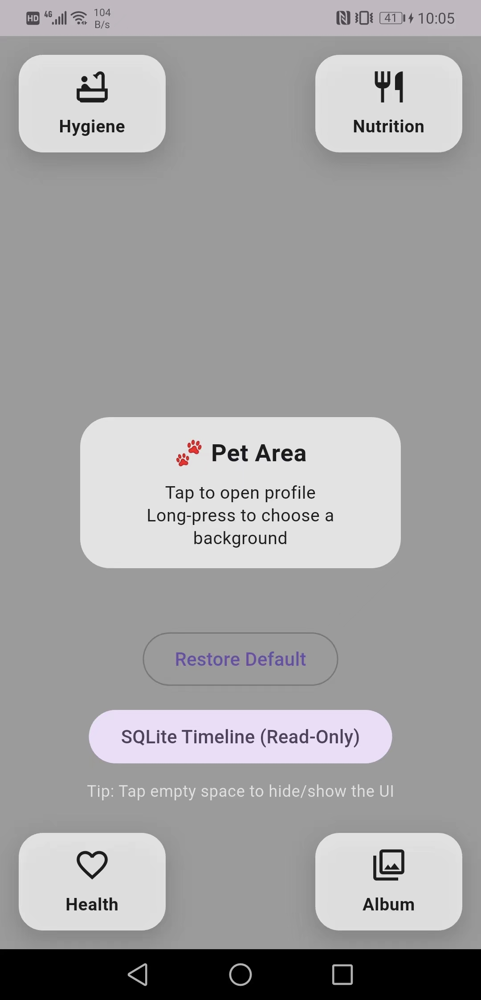
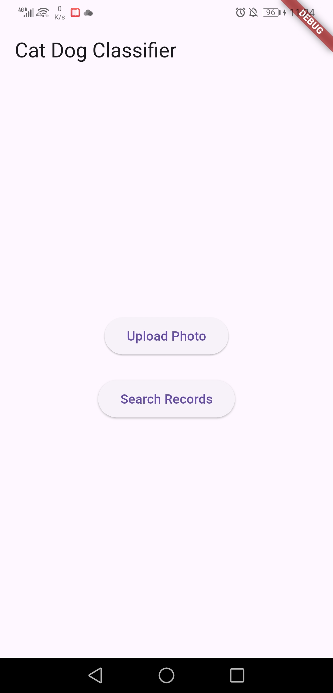
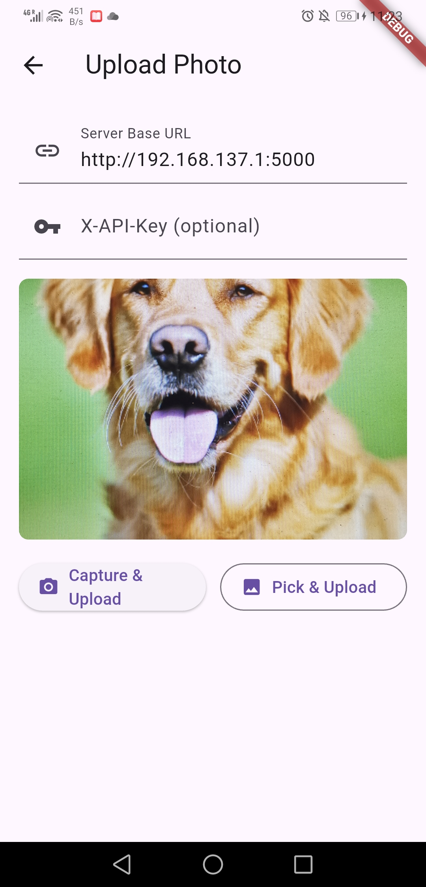
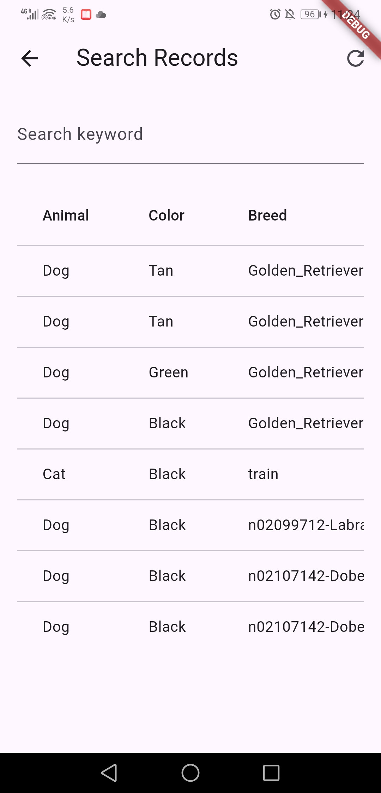
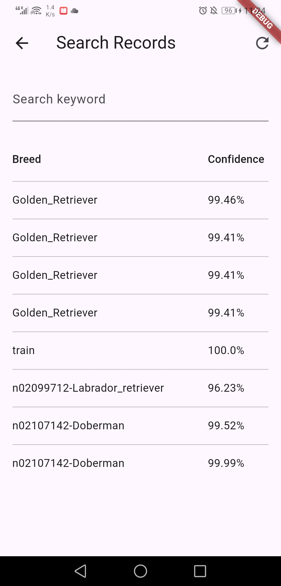

# PetGrowth Diary (diary)

A Flutter-based pet daily-care diary app for tracking routines (food, health, hygiene) with a local SQLite timeline and optional reminders.

## Features

### Food
- Feed log (food/amount/note)
- Water log (amount/note)
- Allergy & preferences editor (free text)

### Health
- Weight log (kg)
- Medication log (name/dosage/schedule/note)
- Vet visit & vaccine log

### Hygiene
- Bath log
- Grooming & cleaning log
- Deworm log (internal / external)
- Clean reminders
  - One-time or weekly schedule
  - Enable/disable toggle
  - Local notifications

### Album
- Timeline-style photo album
- Pick images from gallery and copy into app documents directory
- Delete entry also deletes the image file (best-effort)

### PostgreSQL Timeline (Read-only)
- Aggregated event timeline stored in PostgreSQL
- Overview: total events + counts by type
- Range filter: all / last 30 days / last 7 days
- Event list preview with payload snippet

## Tech Stack
- Flutter / Dart
- SharedPreferences for local snapshots per module
- PostgreSQL for aggregated timeline events
- Local Notifications for reminders (once/weekly)
- image_picker + path_provider for album file management

## Project Structure (high level)
- `lib/features/` - UI modals + stores (feed/health/hygiene/album)
- `lib/db/` - PostgreSQL (`AppDb`, `schema`, `TimelineDao`, timeline read-only page)
- `lib/widgets/` - shared UI (e.g., CenterModal)

## Getting Started

### Prerequisites
- Flutter SDK (stable)
- iOS/Android emulator or a physical device

### Install & Run
```bash
flutter pub get
flutter run
```
### Demo Preview



## Personal Project: Pet Growth Diary

This project is a deep learning-based system for identifying cat/dog breeds from images. It combines a fine-tuned MobileNetV2 classification model, a Flask backend API, and a simple front-end interface (Flutter or web). Users can upload a cat/dog image to receive its predicted breed, color, and confidence score.

### Features

- **Cat/Dog Breed Recognition (15 classes)**  
  Identifies the breed of a cat/dog using a deep learning model based on MobileNetV2, fine-tuned on a labeled dataset of over 30,000 images.

- **Fur Color Detection**  
  Automatically extracts the dominant color from the cat/dog image (e.g. white, gray, black, orange) using RGB heuristics.

- **Full-Stack Integration (Flutter + Flask)**  
  A mobile-friendly front-end built with **Flutter** allows users to:
  - Capture or upload cat/dog images
  - See prediction results (breed, color, confidence)
  - View historical records in a local results table

- **RESTful API with Flask**  
  The backend provides:
  - `/classify`: Accepts an image, returns prediction results.
  - `/records`: Returns a list of past classification records (animal, breed, color, confidence).
  - Model selection and logging integrated.

- **Local SQLite Storage**  
  Stores all classification results along with timestamp and filename, enabling persistent record retrieval from the front-end.

### Model Summary

| Task                     | Dataset Source                      | Image Count | Classes | Model                    | Val Accuracy |
|--------------------------|-------------------------------------|-------------|---------|--------------------------|--------------|
| Cat vs Dog Classification| Kaggle Dogs vs. Cats                | 25,000      | 2       | MobileNetV2              | ~97.1%       |
| Cat Breed Identification | Gano Cat Breed Dataset (15 classes) | 5,625       | 15      | MobileNetV2 (fine-tuned) | ~98.9%       |
| Dog Breed Identification | Stanford Dogs Dataset               | ~7,360      | 37      | MobileNetV2              | ~97.4%       |


### Tech Stack

- **Backend**: Flask (Python)
- **Model**: TensorFlow / Keras (MobileNetV2 architecture)
- **Frontend**: Flutter (or optional HTML template)
- **Database**: SQLite
- **Deployment**: Local or cloud-based Flask server

### Use Cases

- Pet identification apps for shelters or adoption platforms
- Educational demos for CNN and image classification
- Animal dataset labeling tools
- Full-stack AI project showcasing model training, inference, and API integration


### Distributed Inference Mode
This project can run in a **distributed setup** where the REST API acts as a lightweight **gateway**, dispatching image classification requests to multiple **stateless model workers** (each hosting a MobileNetV2 or other trained model).  
Each worker runs independently and can be scaled horizontally on **AWS ECS or Docker Compose**, allowing concurrent inference across replicas.  
The gateway aggregates predictions and provides unified health and metrics endpoints.  
This setup improves throughput, resilience, and deployment flexibility—supporting blue-green updates, autoscaling, and future GPU-based acceleration.


## Datasets Used

1. **Cat-vs-Dog Binary Dataset**
   - Source: [Kaggle Dogs vs. Cats](https://www.kaggle.com/competitions/dogs-vs-cats/data)
   - Purpose: Train a binary classifier to distinguish between cats and dogs.
   - Images: 25,000 

2. **Oxford-IIIT Pet Dataset**
   - Source: [University of Oxford - VGG Group](https://www.robots.ox.ac.uk/~vgg/data/pets/)
   - Purpose: Train a cat breed classifier (only used 12 cat breeds out of 37 total breeds).
   - Images Used: ~2,500 

3. **GanoCat Dataset**
   - Source: Third-party curated dataset ([not publicly hosted](https://www.kaggle.com/datasets/shawngano/gano-cat-breed-image-collection?utm_source=chatgpt.com))
   - Purpose: Improve cat breed classification with 15 cleanly separated categories.
   - Images: 5,625 


## Demo Preview






